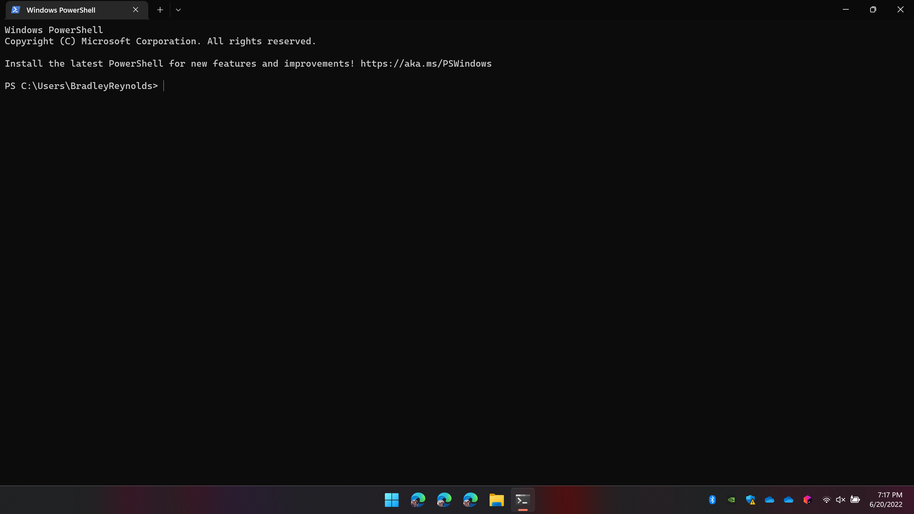
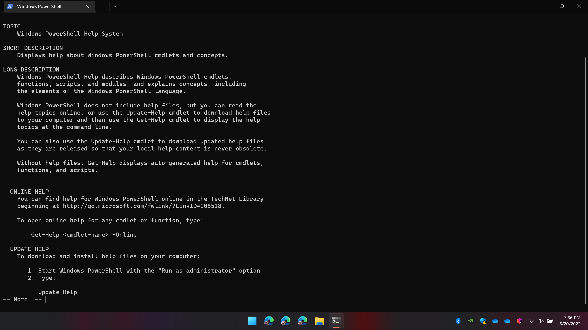
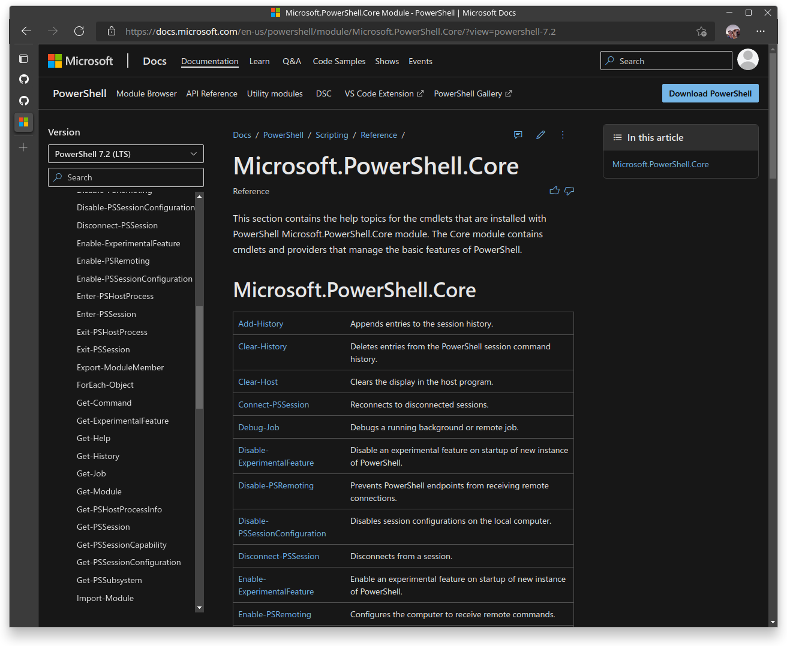

# Getting Started

## Introduction

TODO: write good intro

## Getting Started

Open the start menu and use the search to find and open "Terminal".




Now the terminal is open.

Yep.

It's open.

The cursor is blinking.

What do I put there?

What _can_ I put there?

Can I ask for help? (TODO: do I need to tell people to push enter after typing "help"?)




Aha! I found help!

_Hmm_

```
To get help for a cmdlet, type:

        Get-Help <cmdlet-name>
```

Okay. I can ask for help on a cmdlet.

But... what if I don't know what cmdlets are available?

```
 ONLINE HELP
    You can find help for PowerShell online at
    https://go.microsoft.com/fwlink/?LinkID=108518.
```

Okay, let's try that.



Wow. That's a big list.

Okay, let's pick something to do, and see if that's in the list.

Lets... list the documents in my "My Documents" folder.
